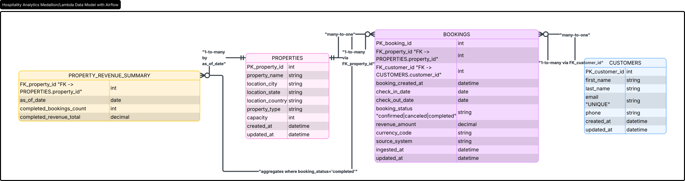
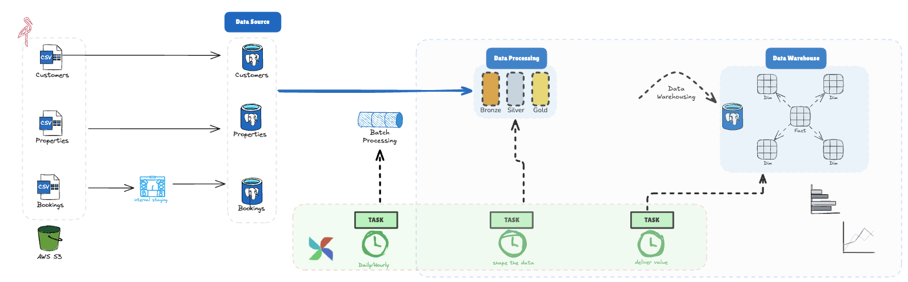

# 📦 Hospitality Data Platform

## 🌟 Highlights

- Track bookings, properties, and customers.
- Revenue tracking.
- Insight report: completed bookings + revenue by property.
- Incremental load from S3 with upsert.
- Error handling in the load process.
- S3 ingestion.
- Medallion architecture.
- Airflow orchestration.

## ℹ️ Overview

> *This document is the complete setup guide for the Hospitality Industry Data Analytics PoC. It covers the architecture, the account information you need to collect before starting, a step-by-step deployment walkthrough, and a reference for all SQL deliverables.*

### ✍️ Authors

Fernando Rodrigues Nepomuceno

## 🧮 Logical Model
> *Three entities match the use case specification directly. A Customer makes one or more Bookings. Each Booking is for one Property. Revenue is tracked at the Booking level and is only counted for completed status.*




## 🏛️ Architecture Diagram 



## Physical Model Decisions


| Decision | Rationale |
| -------- | --------- |
| TEXT primary keys (booking_id, property_id, customer_id) | Match source system IDs; avoids sequence mismatches on incremental loads |
| CHECK constraint on status | Enforces valid enum values at DB level: confirmed / canceled / completed |
| CHECK constraint on revenue >= 0 | Revenue cannot be negative; canceled bookings default to 0 |
| CHECK constraint on check_out > check_in | Prevents logically invalid stay date ranges |
| Indexes on bookings.property_id, customer_id, status, check_in | Speeds up the primary insight query and date-range filtering |
| Bronze schema uses TEXT-only columns | Avoids type errors on raw data; casting happens in silver layer |
| gold.bookings_by_property uses UPSERT | Idempotent refresh — safe to re-run without duplicates |

*Show off what your software looks like in action! Try to limit it to one-liners if possible and don't delve into API specifics.*


## ⬇️ Installation

Simple, understandable installation instructions!

```bash
pip install my-package
```

And be sure to specify any other minimum requirements, like Python versions or operating systems.

*You may be inclined to add development instructions here, don't.*


## 💭 Feedback and Contributing

Add a link to the Discussions tab in your repo and invite users to open issues for bugs/feature requests.

This is also a great place to invite others to contribute in any ways that make sense for your project. Point people to your DEVELOPMENT and/or CONTRIBUTING guides if you have them.
